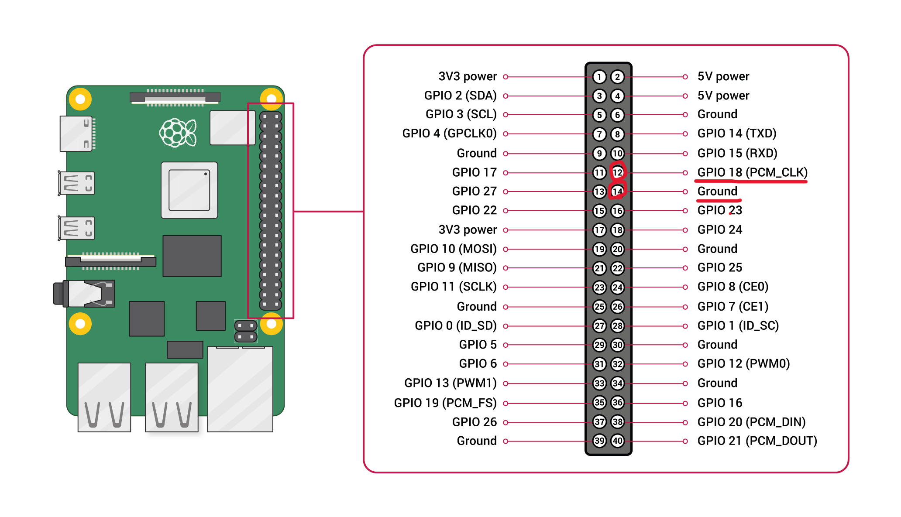

# DoorSensorDevice

このリポジトリは、Raspberry Pi に接続された**ドア開閉センサー**からの信号を取得し、MQTT（AWS IoT Core）を通じてクラウドへ送信するためのスクリプトを提供します。<br>
死活監視（ハートビート）や再接続処理も備えており、クラウド側のシステム（[IoT-django-app-on-aws](https://github.com/Nikitty1226/IoT-django-app-on-aws)）と連携して**遠隔ドア監視**を実現します。


## 使用ハードウェア

- **Raspberry Pi**（動作確認済：Raspberry Pi 3, 4、Raspberry Pi OS (32bit)）
- **ドア開閉センサー**（磁気スイッチ）

使用センサーの詳細：
- [磁気ドアスイッチ（開閉センサー） - 秋月電子通商](https://akizukidenshi.com/catalog/g/g113371/)  
  型番：**SPS-320N**  
  GPIO のプルアップ入力として接続してください。 <br>
  例：センサーの端子をそれぞれGPIO18、GNDへ接続
  


## 機能概要

- GPIOによる**ドアの開閉検知**
- 開閉時の**MQTT送信**（JSON形式）
- **定期的なハートビート送信**（死活監視）
- AWS接続失敗時の**再接続処理**
- ログ出力（ファイル記録）


## フォルダ構成

```text
├── images                # README用画像
├── DoorSensorDevice.py   # メインスクリプト
├── .env                  # 環境変数設定ファイル（git非管理）
├── logfile.log           # ログ出力ファイル（git非管理）
├── cert/                 # AWS IoT証明書（git非管理）
└── README.md             # 本ドキュメント
```


## 必要なパッケージ

事前に以下の Python パッケージをインストールしてください。

```
pip install AWSIoTPythonSDK python-dotenv
```

また、GPIO ライブラリは RPi.GPIO を使用します（通常はRaspberry Piに標準搭載）。


## 証明書の取得と配置

AWS IoT Core にてデバイス用の「モノ（Thing）」を作成し、証明書と秘密鍵を発行してください。  
発行された以下の3つのファイルを `cert/` ディレクトリに保存する必要があります：

- AmazonRootCA1.pem（ルート証明書）
- private.pem.key（秘密鍵）
- certificate.pem.crt（デバイス証明書）

詳細は[IoT-django-app-on-aws](https://github.com/Nikitty1226/IoT-django-app-on-aws) を参照してください。


## .env の例

以下のような `.env` ファイルを作成し、センサー設定や証明書パスを記述してください。

```
CLIENT=DoorSensorClient
ENDPOINT_URL=your-endpoint.iot.ap-northeast-1.amazonaws.com
AWS_ROOT_CA_PATH=cert/AmazonRootCA1.pem
AWS_PRIVATE_KEY_PATH=/home/user/cert/private.pem.key
AWS_CERTIFICATE_PATH=/home/user/cert/certificate.pem.crt
SENSOR_TOPIC=sensor/abc123
GPIO_PIN=18
PUBLISH_INTERVAL=60
RECONNECTION_INTERVAL=10
```

> ※ `SENSOR_TOPIC` は、**sensor/末尾にGUI上で設定したデバイスID**で設定する必要があります。詳細は[IoT-django-app-on-aws](https://github.com/Nikitty1226/IoT-django-app-on-aws)を参照してください。


## 実行方法

```
python3 DoorSensorDevice.py
```

起動すると、センサーの状態変化とハートビートが MQTT を通じて送信されます。ログは `logfile.log` に記録されます。


## systemd での自動起動

自動起動させたい場合、以下のような systemd ユニットファイルを `/etc/systemd/system/doorsensordevice.service` に作成してください。

```
[Unit]
After=network.target

[Service]
ExecStartPre=/bin/sleep 30
ExecStart=/usr/bin/python3 /home/user/src/DoorSensorDevice/DoorSensorDevice.py
WorkingDirectory=/home/user/src/DoorSensorDevice
StandardOutput=inherit
StandardError=inherit
Restart=always
User=user

[Install]
WantedBy=multi-user.target
```

有効化・起動は以下のコマンドで行えます。

```
sudo systemctl enable doorsensordevice
sudo systemctl start doorsensordevice
```


## ライセンス

© Masayoshi Niki - MIT License<br>
Apache License Version 2.0 ライセンスの下で配布されています。詳細は [`LICENSE`](LICENSE) を参照してください。


## 作者

**Masayoshi Niki**  
IoT技術者／クラウドアプリエンジニア志望  
GitHub: [@Nikitty1226](https://github.com/Nikitty1226)


## 補足：関連リポジトリ

このスクリプトは、[IoT-django-app-on-aws](https://github.com/Nikitty1226/IoT-django-app-on-aws) によって構築されたクラウド側のアプリケーションと連携して動作します。
